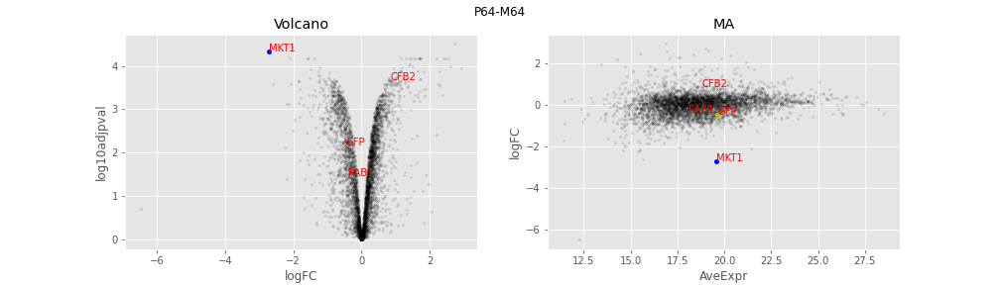
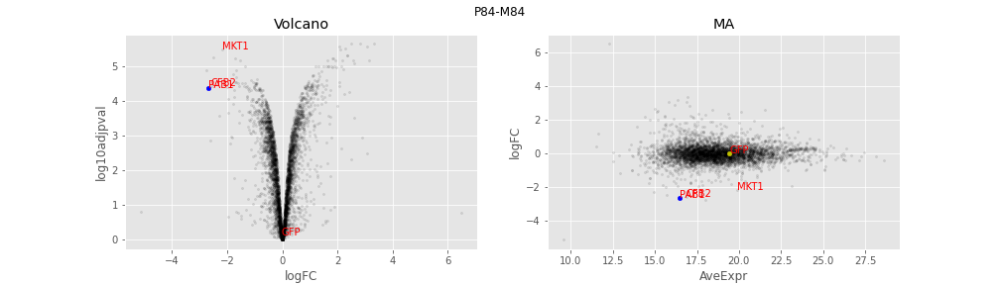
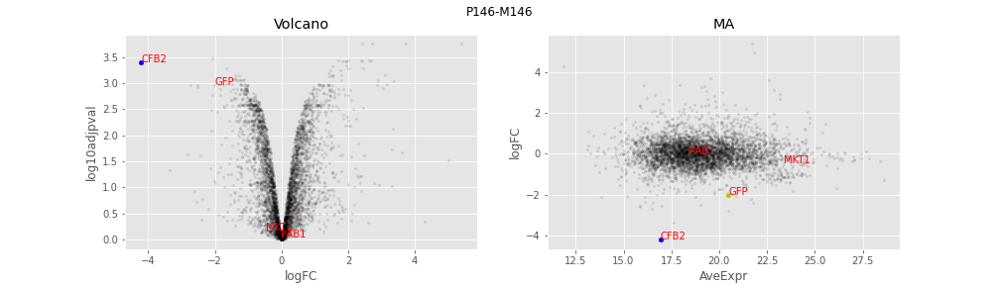
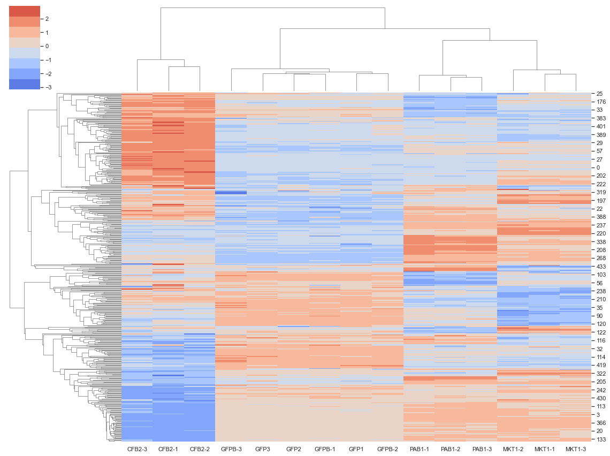

# Proteome analysis of RNA Binding Protein KO

[Zenodo ph]

## Affiliation
    Wellcome Centre for Anti-Infectives Research
    School of Life Sciences, University of Dundee

## Description

This analysis includes three strains that knock down different RBPs proteins (MKT1, PBP1 and CFB2) induced with TET (3 biological replicates each). The parental strains (GFP) without TET induction for the first batch (MKT1, PBP1) and second batch (CFB2) are also included.

## Analysis MKT1 and PBP1
The notebook "DIA_20210618/analysis_927_first_batch.ipynb" analyses the differential protein abundance before and after TET induction for the MKT1 and PBP1 strains.

  

## Analysis CFB2
The notebook "RBPs 2nd batch 927/RBPs 2nd batch 927" analyses the differential protein abundance before and after TET induction for the CFB2 strain.

 

## Cluster Analysis
The notebook "merge_datasets_def.ipynb" aggregates the results, removes the batch effect and clusters the MKT1, PBP1 and CFB2 proteins according to the protein abundance after TET induction.

    